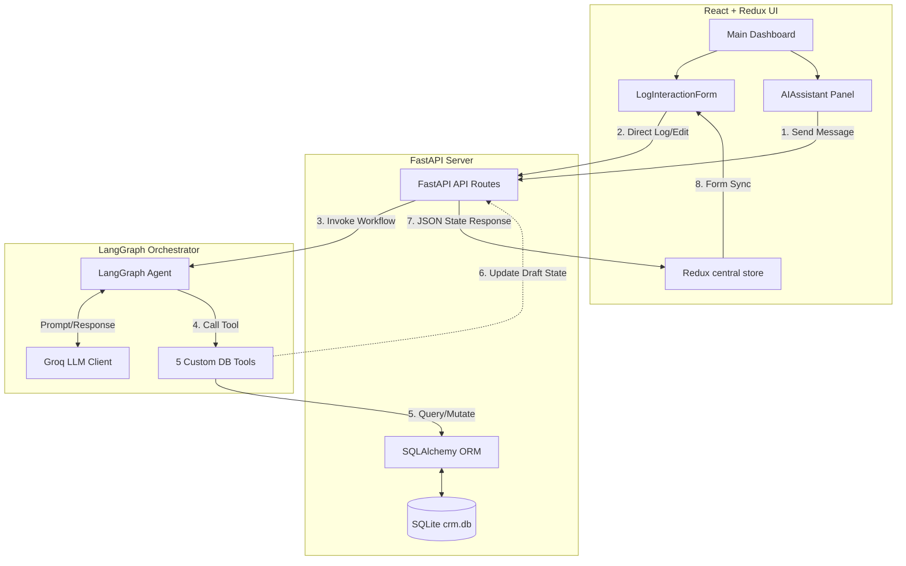
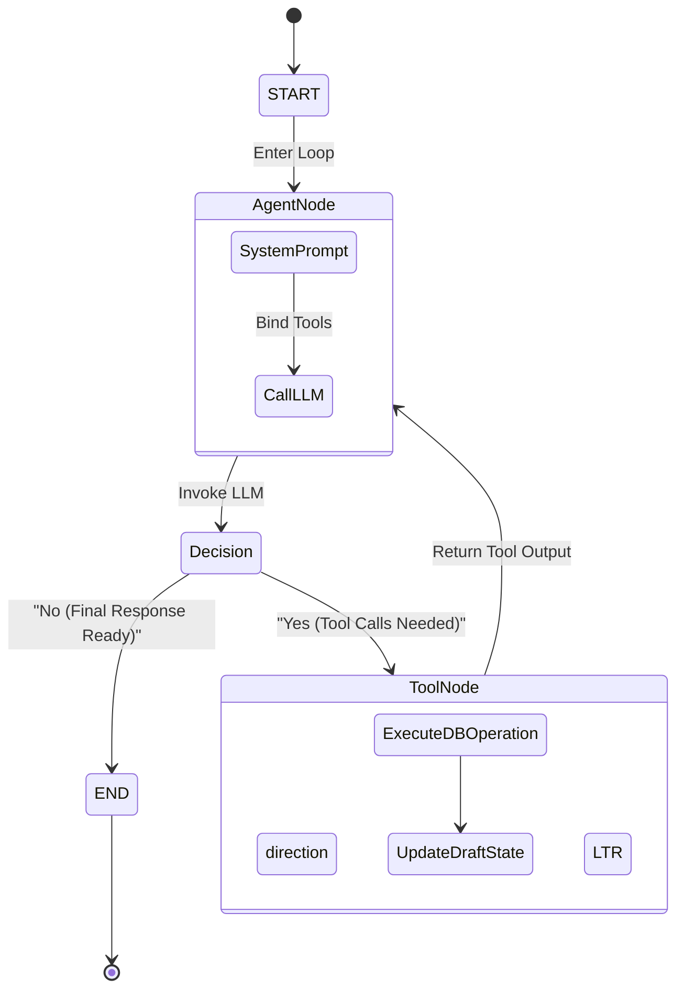
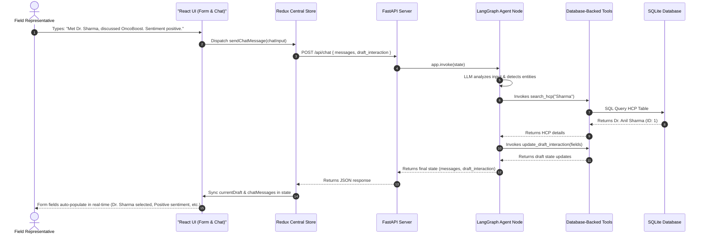
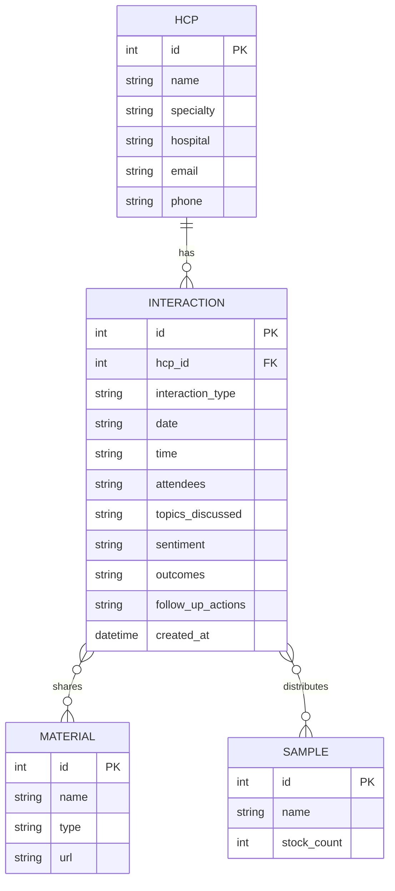

# Aivoa CRM: AI-First HCP Module (Log Interaction Screen)
## Technical Architecture, Database Design, System Flow, and Running Guide

Welcome to the comprehensive technical documentation for the **Aivoa CRM HCP Module**. This module is designed to bridge the gap between traditional structured CRM forms and conversational inputs, giving life sciences field representatives the flexibility to log interactions using a structured web interface, a voice-to-text transcript parser, or an AI agent chat panel.

---

## 👨‍💻 Candidate Profile

> [!NOTE]
> **Developer Profile Details:**
> - **Name:** Chaitanya Jagan
> - **Email:** [chaitanyajagan2005@gmail.com](mailto:chaitanyajagan.dev@gmail.com)
> - **LinkedIn:** [linkedin.com/in/chaitanyajagan](https://linkedin.com/in/chaitanyajagan)
> - **GitHub:** [github.com/chaitanyajagan](https://github.com/chaitanyajagan)
> - **Specialization:** Artificial Intelligence, NLP, Full-Stack Agentic Workflows & System Architecture

---

## 📋 Table of Contents
1. [Executive Summary & Objective](#1-executive-summary--objective)
2. [Core Requirements & Tech Stack](#2-core-requirements--tech-stack)
3. [Monorepo Directory Structure](#3-monorepo-directory-structure)
4. [High-Level System Architecture](#4-high-level-system-architecture)
5. [LangGraph AI Agent & State Machine](#5-langgraph-ai-agent--state-machine)
6. [Real-Time Form Synchronization Flow](#6-real-time-form-synchronization-flow)
7. [Database Relational Design & Tables](#7-database-relational-design--tables)
8. [Inventory & Sentiment Analytics](#8-inventory--sentiment-analytics)
9. [LangGraph Tool Specifications](#9-langgraph-tool-specifications)
10. [Running & Installation Instructions](#10-running--installation-instructions)
11. [Verification & Integration Tests](#11-verification--integration-tests)

---

## 1. Executive Summary & Objective

In the life sciences sector, pharmaceutical and medical representatives interact with Healthcare Professionals (HCPs) daily. Traditional CRM tools require representatives to manually fill complex, time-consuming structured forms to record details, sample distribution, and feedback.

**Aivoa CRM** bridges this gap by introducing an **AI-First Log Interaction Screen** with a dual-interface layout:
1. **Structured Web Form:** Allows reps to manually edit fields, select doctors, check boxes, and specify exact quantities of educational materials and drug samples.
2. **Conversational Assistant Chat Console:** A Groq-powered AI agent using a LangGraph state machine. When the user types or dictates a conversational summary of their visit, the AI agent identifies key entities, maps doctors to IDs, matches drug names to inventory samples, parses the sentiment of the interaction, and automatically synchronizes the details back into the active React form state in real-time.

---

## 2. Core Requirements & Tech Stack

The application is built as a monorepo featuring a clean division between client-side state handling and server-side relational database execution.

| Layer | Technology Choice | Functionality & Rationale |
| :--- | :--- | :--- |
| **Frontend UI** | **React (Vite template)** | Provides a highly responsive, modern component-based SPA architecture. |
| **State Management** | **Redux Toolkit** | Centralizes the application state, managing the form draft, lists, loading indicators, and synchronizing LLM extraction payloads with React views. |
| **Styling System** | **Vanilla CSS** | Implements custom HSL variables, fluid typography (Inter), glassmorphism styles, responsive grid splits, and smooth transition animations. |
| **Backend Framework** | **FastAPI (Python 3.10+)** | Exposes high-performance asynchronous REST endpoints with automated OpenAPI (Swagger) documentation. |
| **AI Orchestrator** | **LangGraph** | Models the conversational flow as a state graph containing loops, conditional routes, and database tools. |
| **Inference LLM** | **Groq Client (`gemma2-9b-it`)** | Fast, low-latency LLM execution for real-time text analysis. Falls back to a rule-based mock engine if no key is configured. |
| **Database & ORM** | **SQLite & SQLAlchemy ORM** | Zero-configuration local relational database. Tracks inventory counts and maintains relation associations. |

---

## 3. Monorepo Directory Structure

The project code is organized logically into backend and frontend directories:

```text
aivoa/
├── backend/
│   ├── database.py             # SQLite setup, tables (HCP, Material, Sample, Interaction) & SQLAlchemy ORM
│   ├── seed.py                 # Seeding script to create initial doctors, studies, and sample inventory
│   ├── agent.py                # LangGraph State Graph definitions and the 5 specific DB tools
│   ├── main.py                 # FastAPI endpoints, CORS middleware, and Uvicorn runner
│   ├── verify_backend.py       # Integration verification script hitting all FastAPI routes
│   ├── generate_report.py      # Script generating MS Word report docs and charts (PIL/Matplotlib)
│   ├── generate_docs.py        # Helper to generate basic MS Word documentation
│   └── requirements.txt        # Python pip package listings
├── frontend/
│   ├── src/
│   │   ├── components/
│   │   │   ├── AIAssistant.jsx        # Conversational assistant panel with suggested prompt buttons
│   │   │   ├── LogInteractionForm.jsx # Structured log form with simulated audio transcription drawer
│   │   │   ├── InteractionHistory.jsx # Feed showing all logged items with inline edits
│   │   │   └── SettingsModal.jsx      # Groq API settings modal
│   │   ├── store/
│   │   │   └── index.js               # Redux Store: slices, actions, and async fetch thunks
│   │   ├── App.jsx                    # Core wrapper supporting dark theme state toggling
│   │   ├── index.css                  # Style sheet containing standard design variables
│   │   └── main.jsx                   # Vite bootstrap entry point
│   ├── package.json                   # Web dependencies (Redux, Lucide, standard React)
│   └── vite.config.js                 # Vite compile configurations
├── AI_First_CRM_HCP_Module_Documentation.docx  # Full technical word document
└── README.md                          # Visual architecture and running commands (this file)
```

---

## 4. High-Level System Architecture

The following flowchart describes the high-level components and data paths across the React client, FastAPI server, LangGraph engine, and SQLite database:

### 📊 System Flowchart



---

## 5. LangGraph AI Agent & State Machine

The AI agent tracks a state definition containing the conversational message history, the active interaction form draft object, and a list of suggested follow-up actions. 

When a payload hits `/api/chat`, the LangGraph compilation triggers. The `Agent Node` runs the Groq LLM model (`gemma2-9b-it`). If the LLM determines that a database lookup or mutation is needed (e.g. querying HCPs, saving a log, or checking stock levels), it outputs a tool-call request. The graph conditionally routes to the `Tool Node` which executes the Python database functions before returning to the `Agent Node`. If no tool calls are needed, the final message is returned to the user.

### 🔄 Agent State Diagram



---

## 6. Real-Time Form Synchronization Flow

The sequence diagram below shows the detailed telemetry of a rep describing an interaction with a doctor in the chat panel, leading to real-time form extraction and population:



---

## 7. Database Relational Design & Tables

The database is built on SQLite, structured via SQLAlchemy ORM. The relational models include Healthcare Professionals (HCPs), educational materials, drug samples, and logged interactions. Many-to-many associations track which materials were shared and which samples were distributed during any given interaction.

### 📐 Entity-Relationship Diagram



### 🗄️ Relational Database Schema & Seeding Details

#### 1. Healthcare Professionals (HCPs)
This table stores clinical contact profiles for targeting and logging interactions.
| Column | Type | Constraints | Description |
| :--- | :--- | :--- | :--- |
| `id` | Integer | Primary Key, Index | Unique Identifier |
| `name` | String | Not Null, Index | Doctor's Full Name |
| `specialty` | String | Not Null | Area of Medicine |
| `hospital` | String | Not Null | Affiliated Clinic / Location |
| `email` | String | Nullable | Contact Email |
| `phone` | String | Nullable | Contact Phone Number |

*Seeded Rows:*
1. **Dr. Anil Sharma** (Oncology) — Apollo Hospital, Delhi (`anil.sharma@apollo.com`)
2. **Dr. Sarah Smith** (Cardiology) — City General Hospital, Mumbai (`sarah.smith@cityhospital.com`)
3. **Dr. Priya Patel** (Pediatrics) — Children's Health Clinic, Bangalore (`priya.patel@childrenshealth.com`)
4. **Dr. James Davis** (Neurology) — Neurological Institute, Pune (`james.davis@neuroinstitute.com`)

#### 2. Educational & Clinical Materials
Marketing leaflets and clinical study documents shared during discussions.
| Column | Type | Constraints | Description |
| :--- | :--- | :--- | :--- |
| `id` | Integer | Primary Key, Index | Unique Identifier |
| `name` | String | Not Null | Leaflet/PDF Resource Title |
| `type` | String | Not Null | E.g. Brochure, Clinical Study, Slide Deck |
| `url` | String | Nullable | HTTP link to resource file |

*Seeded Rows:*
1. **OncoBoost Phase III Clinical Trial PDF** (Clinical Study)
2. **CardioLife Patient Care Brochure** (Brochure)
3. **NeuroShield Efficacy Slides** (Slide Deck)
4. **PediatraCare Dosage Chart** (Brochure)

#### 3. Drug Samples Stock Inventory
Physical drug samples left with physicians for clinical trials and patient evaluations.
| Column | Type | Constraints | Description |
| :--- | :--- | :--- | :--- |
| `id` | Integer | Primary Key, Index | Unique Identifier |
| `name` | String | Not Null | Product Name & Dosage Strength |
| `stock_count` | Integer | Default: 100 | Remaining Units |

*Seeded Rows:*
1. **OncoBoost 10mg Tablets** — Stock: `50 units`
2. **CardioLife 5mg Capsules** — Stock: `100 units`
3. **NeuroShield 20mg Tablets** — Stock: `30 units`
4. **PediatraCare Liquid Suspension** — Stock: `200 units`

#### 4. Interaction Logs
Main registry of visits, calls, and virtual touchpoints.
| Column | Type | Constraints | Description |
| :--- | :--- | :--- | :--- |
| `id` | Integer | Primary Key, Index | Unique Identifier |
| `hcp_id` | Integer | Foreign Key (`hcps.id`) | Linked Doctor ID |
| `interaction_type` | String | Not Null (Default: Meeting) | E.g. Meeting, Call, Email |
| `date` | String | Not Null | YYYY-MM-DD |
| `time` | String | Not Null | HH:MM |
| `attendees` | String | Nullable | Comma-separated names |
| `topics_discussed` | Text | Nullable | Detailed discussion summary |
| `sentiment` | String | Not Null (Default: Neutral) | E.g. Positive, Neutral, Negative |
| `outcomes` | Text | Nullable | Decisions made |
| `follow_up_actions`| Text | Nullable | Next planned steps |
| `created_at` | DateTime | Default: UTC Now | Log timestamp |

---

## 8. Inventory & Sentiment Analytics

The application tracks sample consumption and client sentiments to evaluate campaign effectiveness. The charts below display the inventory balance and call feedback distributions:

### 📈 Current Sample Inventory Stock Levels

This chart shows remaining stock units for each sample. Stocks automatically decrement as reps log sample distributions during doctor visits.


### 📊 Logged Interactions Sentiment Analysis

This chart tracks the overall sentiment split (Positive, Neutral, Negative) of doctor interactions logged in the CRM database.


---

## 9. LangGraph Tool Specifications

The AI agent leverages six custom Python functions decorated as tools to query and mutate SQLite data:

1. **`search_hcp(query: str) -> str`**
   - *Arguments:* `query: str` (doctor's name, hospital, or specialty)
   - *Behavior:* Performs an OR query using `LIKE` filters. Returns a serialized JSON list of matched doctors.
   
2. **`get_available_materials_and_samples() -> str`**
   - *Arguments:* None
   - *Behavior:* Queries the database for all available materials and drug samples (including stock levels) so the LLM can resolve names to correct IDs.
   
3. **`get_interaction_history(hcp_id: int) -> str`**
   - *Arguments:* `hcp_id: int`
   - *Behavior:* Queries all logged interactions linked to the specified HCP, ordered chronologically. Returns a JSON string of past touchpoints.
   
4. **`log_interaction(...) -> str`**
   - *Arguments:* `hcp_id`, `interaction_type`, `date`, `time`, `attendees`, `topics_discussed`, `materials_shared_ids`, `samples_distributed_ids`, `sentiment`, `outcomes`, `follow_up_actions`.
   - *Behavior:* Creates a new database record, maps many-to-many associations, decrements sample stocks, and commits the transaction.
   
5. **`edit_interaction(interaction_id: int, updated_fields: Dict[str, Any]) -> str`**
   - *Arguments:* `interaction_id: int`, `updated_fields: dict`
   - *Behavior:* Modifies specified columns of a logged interaction and commits the changes.
   
6. **`update_draft_interaction(fields: Dict[str, Any]) -> str`**
   - *Arguments:* `fields: dict` (key-value pairs of extracted form parameters)
   - *Behavior:* Communicates extraction data back to the FastAPI client in real-time, syncing the React UI form fields instantly.

---

## 10. Running & Installation Instructions

### Prerequisites
- **Python:** Version 3.10 or higher (with pip)
- **Node.js:** Version 18 or higher (with npm)

### Backend Installation

1. Navigate to the backend folder:
   ```bash
   cd backend
   ```

2. Create a virtual environment:
   ```bash
   python -m venv venv
   ```

3. Activate the virtual environment:
   - **Windows (PowerShell):**
     ```powershell
     .\venv\Scripts\Activate.ps1
     ```
   - **Mac/Linux:**
     ```bash
     source venv/bin/activate
     ```

4. Install python dependencies:
   ```bash
   pip install -r requirements.txt
   ```

5. Seed the SQLite database (`crm.db`):
   ```bash
   python seed.py
   ```

6. Start the FastAPI Uvicorn web server:
   ```bash
   python main.py
   ```
   *The backend will run on `http://127.0.0.1:8000`. You can inspect endpoints and try requests via the Swagger page at `http://127.0.0.1:8000/docs`.*

---

### Frontend Installation

1. Open a new terminal window and navigate to the frontend folder:
   ```bash
   cd frontend
   ```

2. Install node packages:
   ```bash
   npm install
   ```

3. Launch the Vite client development server:
   ```bash
   npm run dev
   ```

4. Open `http://localhost:5173` in your browser to load the dashboard.

---

### Groq LLM Configuration

The application is equipped with a rule-based mock engine to support offline testing. For high-fidelity LLM parsing:
1. Open the web interface at `http://localhost:5173`.
2. Click the **Gear Icon (Settings)** in the top-right corner.
3. Paste your **Groq API Key**.
4. Save the settings. The top status pill will switch from **Mock LLM Fallback** to **Groq LLM Active**.

---

## 11. Verification & Integration Tests

The project includes an integration script that runs tests against all endpoints:

1. Ensure the FastAPI backend server is running (`python main.py` in the `backend` folder).
2. Run the integration check:
   ```bash
   python backend/verify_backend.py
   ```

### Expected Test Output
```text
Testing FastAPI Backend APIs...

1. Testing GET /api/hcps...
Success! Found 4 HCPs.
 - Dr. Anil Sharma (Oncology)
 - Dr. Sarah Smith (Cardiology)
 - Dr. Priya Patel (Pediatrics)
 - Dr. James Davis (Neurology)

2. Testing GET /api/materials-samples...
Success! Found 4 materials and 4 samples.

3. Testing POST /api/voice-summarize...
Success! Extracted fields:
{
  "status": "success",
  "extracted_fields": {
    "topics_discussed": "Transcription summary: Met Dr. Sarah Smith, discussed CardioLife, Positive sentiment, shared dosage guide.",
    "date": "2026-07-14",
    "time": "15:45",
    "hcp_id": 2,
    "sentiment": "Positive",
    "materials_shared_ids": [2],
    "samples_distributed_ids": [2]
  }
}

4. Testing POST /api/interactions...
Success! Logged interaction:
{
  "status": "success",
  "message": "Successfully logged interaction with Dr. Anil Sharma.",
  "id": 5
}

5. Testing PUT /api/interactions/5...
Success! Updated interaction:
{
  "status": "success",
  "message": "Updated interaction ID 5."
}

6. Testing POST /api/chat (Mock agent execution)...
Success! Chat response:
{
  "messages": [
    {
      "role": "assistant",
      "content": "I received your message. Let me know if you would like to search for an HCP, view their history, or log/edit an interaction."
    }
  ],
  "draft_interaction": {
    "hcp_id": 2,
    "sentiment": "Positive",
    "topics_discussed": "Discussed CardioLife side-effects and dosage.",
    "materials_shared_ids": [2],
    "samples_distributed_ids": [2]
  },
  "suggested_followups": [
    "Schedule follow-up meeting in 1 week",
    "Send CardioLife Brochure"
  ]
}
```
